# Maxim Healthcare assignment template
*Current version: v0.9.0*

## How to use
- Import the previous assignment (to prevent repetitive assignment)
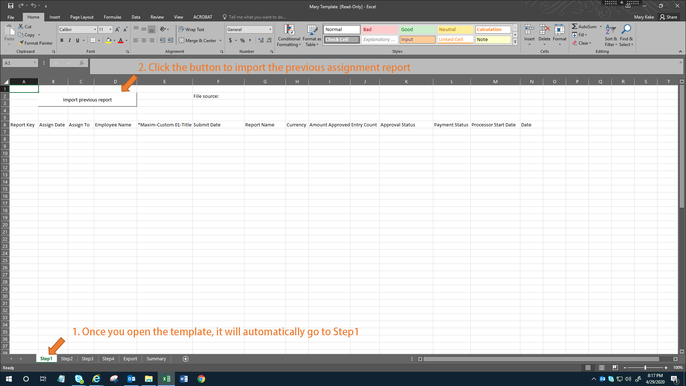
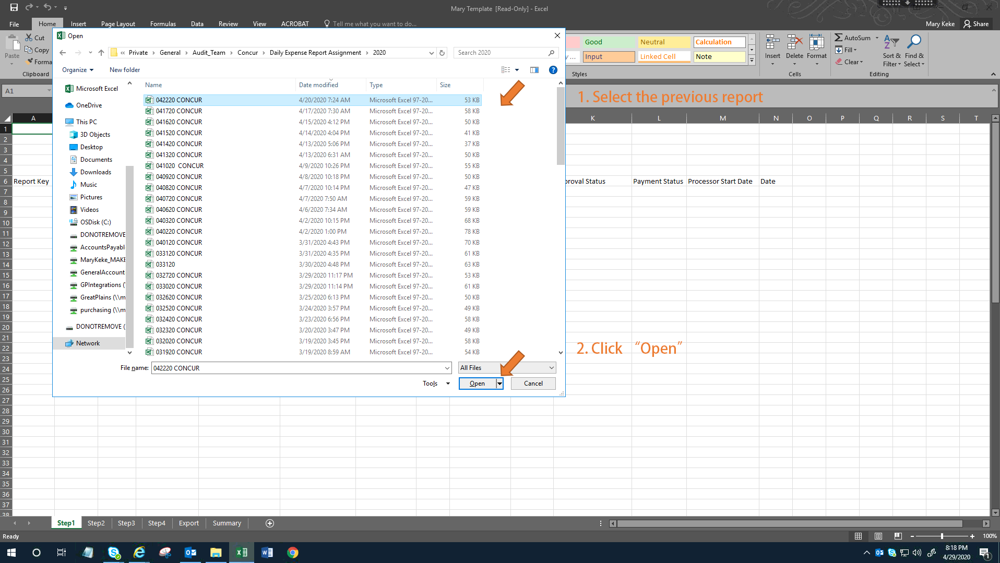

- After importing the previous assignment, you will be asked to import the new dataset exported from the internal Maxim server
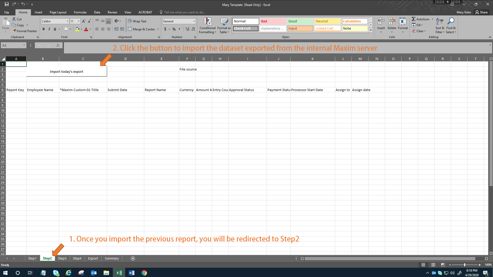
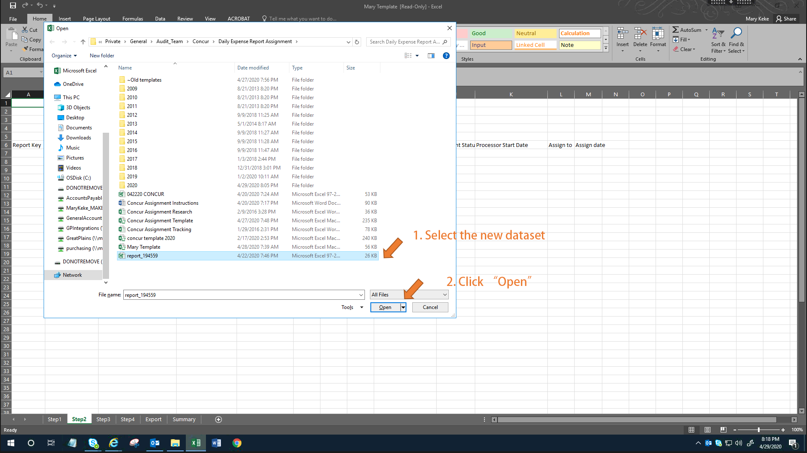

- After importing all data, you may check the previous assignment and assign the new tasks
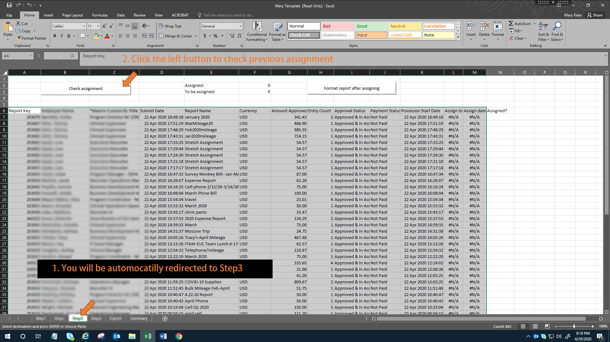
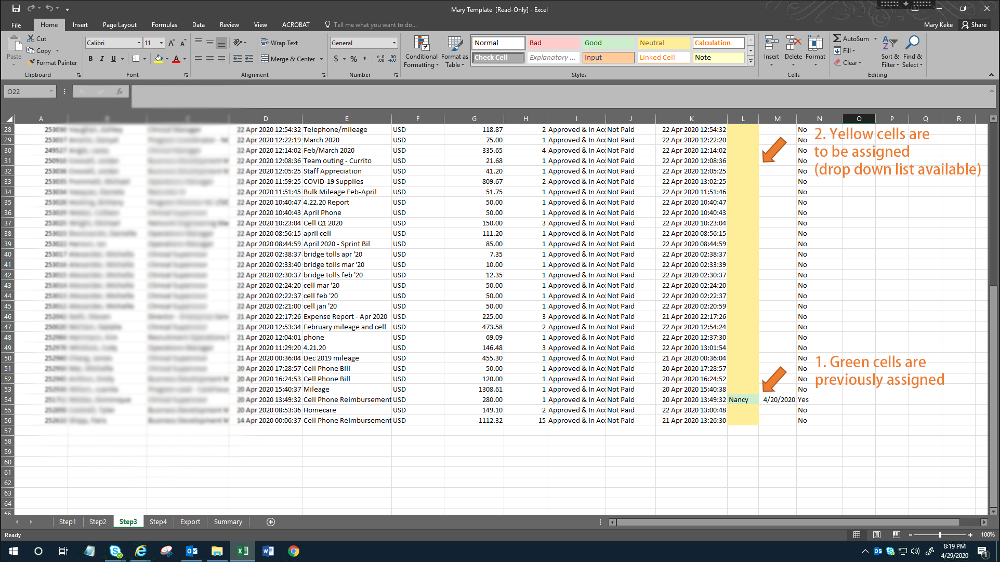
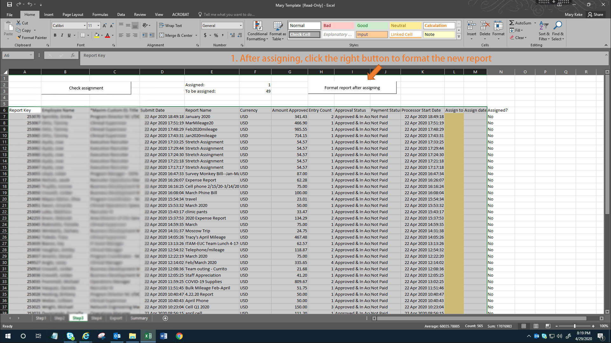

- After assigning and formatting, you may export the new report
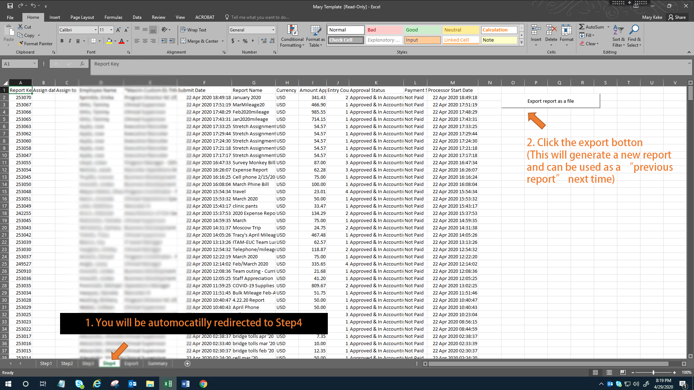
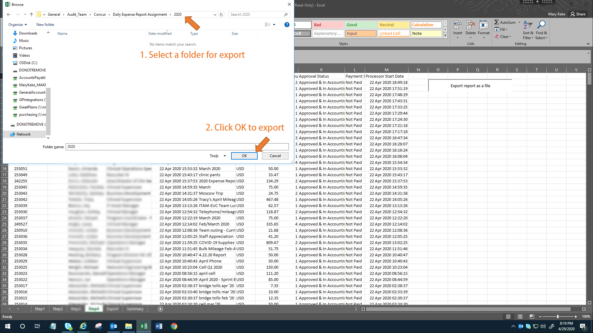
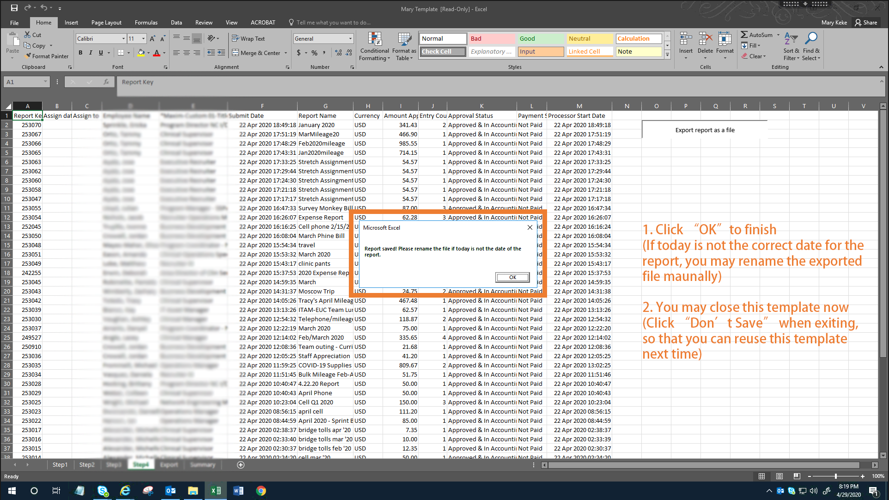

- If you need to see the assignment for each individuals, you may use "Filter" function in excel
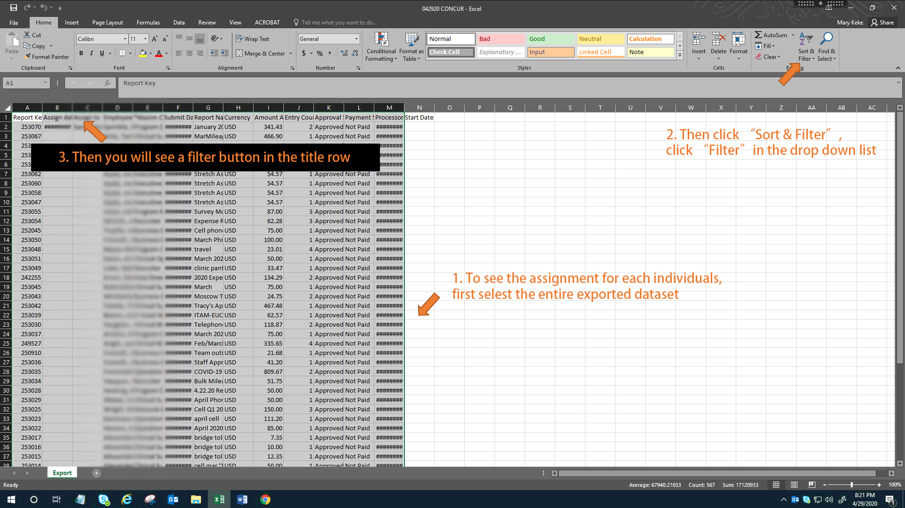
